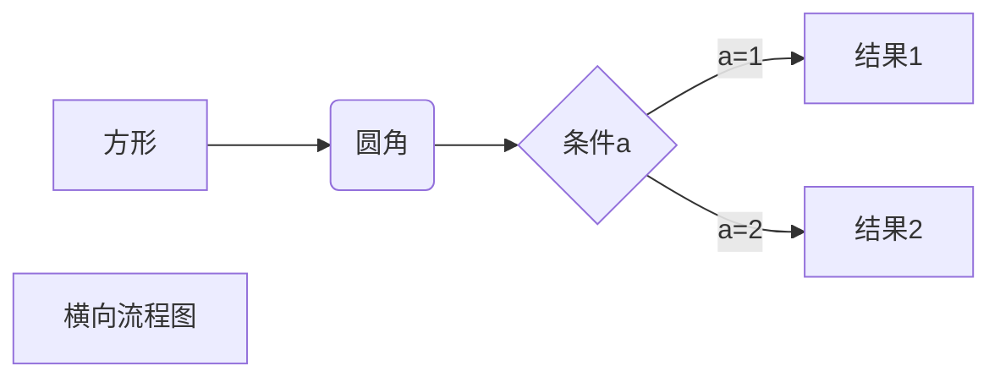

<center>


markdown 常用基础语法
</center>
<!-- more -->

# markdown基础语法

---

## 标题

Markdown支持六种级别的标题，对应的HTML标题h1~h6
``` 
# h1
# h2
## h3
## h4
### h5
### h6
```
---
## 段落和区块引用
> 使用 > 可以强调文字使其高亮显示
```
> 最外层
> > 第一层嵌套
> > > 第二层嵌套
```
> 最外层
> > 第一层嵌套
> >
> > > 第二层嵌套
---
## 插入链接和图片
链接和图片的唯一区别就是最前方添加了一个感叹号。
```
[点击跳转至百度](http://www.baidu.com)或者直接使用链接地址<www.baidu.com>


还可以使用：，还可以通过style调整显示大小
```
效果如下：
<www.baidu.com>
[点击跳转至百度](www.baidu.com)


## 列表
- 无序列表使用*或+或-标识
- 有序列表使用数字加 . 标识

``` 
* 黄瓜
+ 玉米
- 茄子
1.黄瓜
2.玉米
3.茄子
```

* 黄瓜
+ 玉米

- 茄子

1. 黄瓜
2. 玉米
3. 茄子

---

## 分割线

``` 
***
---
```

***

---

---

## 强调

```
*这里是斜体*
_这里是斜体_

**这里是加粗**
__这里是加粗__

~~这是删除线~~

<u>这是下划线</u>

脚注[^要注明的文本]
```

*这里是斜体*
_这里是斜体_

**这里是加粗**
__这里是加粗__

~~这是删除线~~

<u>这是下划线</u>

脚注[^要注明的文本]

---

## 插入代码块

- 行内代码使用反引号包裹起来

- 整段代码使用两个以上的反引号进行包裹

```
这是一段`var x = 3`行内代码

``fun (x: Int, y: Int): Int {
  return x + y
}``
```

这是一段`var x = 3`行内代码

``fun (x: Int, y: Int): Int {
  return x + y
}``

---

## 插入表格

```
| 左对齐 | 右对齐 | 居中对齐 |
| :----- | -----: | :------: |
| 单元格 | 单元格 |  单元格  |
| 单元格 | 单元格 |  单元格  |
或
| | | | 即可
```

| 左对齐 | 右对齐 | 居中对齐 |
| :----- | -----: | :------: |
| 单元格 | 单元格 |  单元格  |
| 单元格 | 单元格 |  单元格  |

注：三个短斜杠左右的冒号用于控制对齐方式，只放置左边冒号表示文字居左，只放置右边冒号表示文字居右，如果两边都放置冒号表示文字居中。

---

## 特殊符号处理

使用反斜杠 \  插入语法中用到的特殊符号。主要有一下几种特殊符号需要处理：

```
\   反斜线
`   反引号
*   星号
_   底线
{}  花括号
[]  方括号
()  括弧
#   井字号
+   加号
-   减号
.   英文句点
!   惊叹号
```

例如：如果你需要插入反斜杠，就连续输入两个反斜杠即可：\\\\=>\

注：在内容中输入以上特殊符号的时候一定要注意转义，否则将导致内容显示不全，甚至排版混乱。

---

## 文字上色

markdown不能给文字上色。但你可以这么做：

1. 先用markdown编辑完成
2. 导出为html，在需要上色的部分手动添加标签`<font color='#ff000'></font>`保存即可。

---

## typora画流程图等

例如：




---

## 居中

支持 html 语法
直接使用：`<center></center>` 标签内的内容都会居中